**Working on a Client Computer**

**Useful Commands**

- **Ping** (ping -t \<IP\>): Continuously checks network connectivity to
  a target host. This can be useful when troubleshooting connectivity
  and whether a machine has regained/lost connection.

- **Group Policy Result** (gpresult /r \> C:\\results.txt): Generates a
  report of Group Policy settings applied to the computer and user. It
  is exported to the designated path.

- **Force Group Policy Update** (gpupdate /force): Immediately applies
  any updated Group Policy settings.

------------------------------------------------------------------------

**Common Active Directory Issues & Resolutions**

**Account Password Lockout**

- Open **Active Directory Users and Computers (ADUC)**.

- Locate the affected user (Xu in this example).

- Check the **Unlock Account** option to restore access if it's locked.

**Disabled Account (Due to Vacation, Absence, or Other Reasons)**

- In **ADUC**, find the user account.

- Right-click and select **Enable**.

- If necessary, reset the user's password using the same method.

**Expired Accounts**

- If a user is unable to log in, check if their account has expired.

- Extend the expiration date or re-enable the account in **ADUC**.

- Often, expired accounts indicate that login credentials need to be
  updated.

**Computer Has Fallen Off the Domain**

1.  Log in using a **local administrator account**.

2.  Remove the computer from the domain by switching it to a
    **Workgroup**.

3.  Restart the computer.

4.  Rejoin the domain and restart again to apply changes.

------------------------------------------------------------------------

**Shared Drive Permissions with Security Groups**

**Creating Shared Drives**

1.  Open **Server Manager** -\> **File and Storage Services** -\>
    **Shares**.

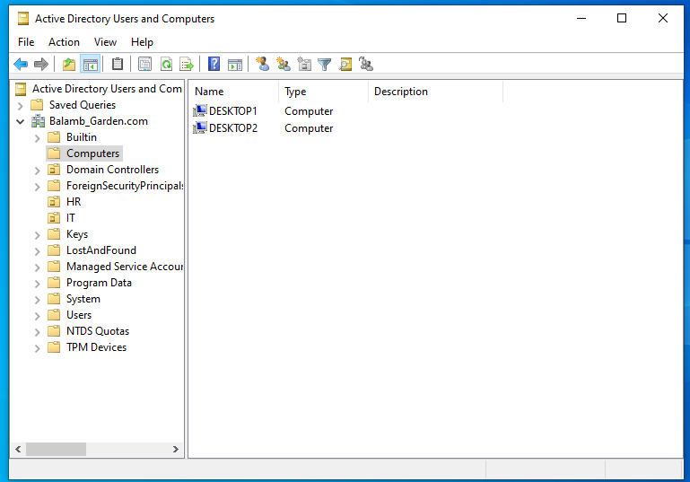{width="5.683490813648294in"
height="3.8333333333333335in"}

2.  Select **New Share** and create:

    - A shared folder named HR.

    - A shared folder named Personal.

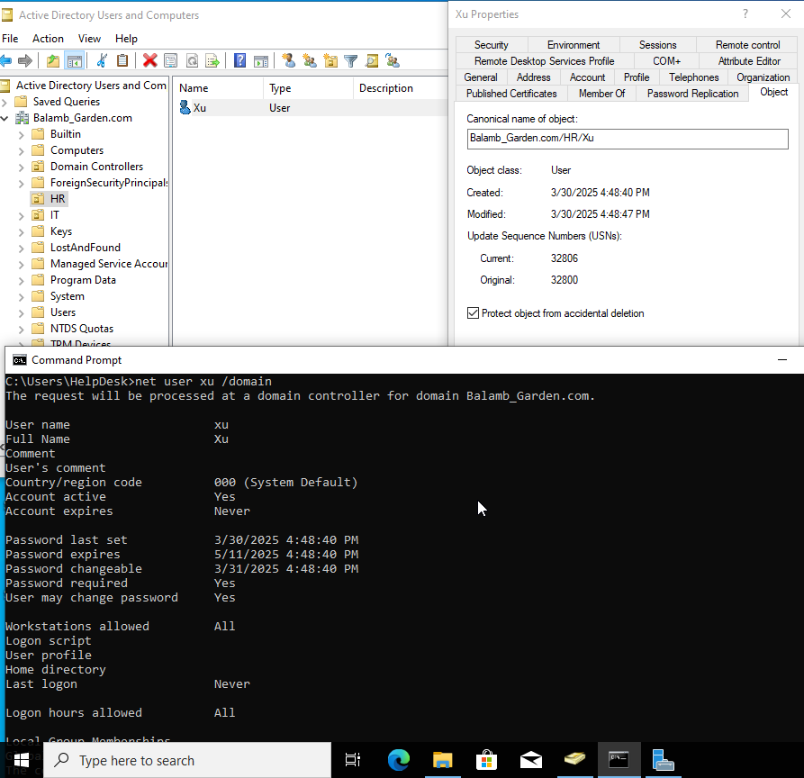{width="5.520833333333333in"
height="3.9479166666666665in"}

3.  Leave default settings unchanged unless specific requirements
    dictate otherwise.

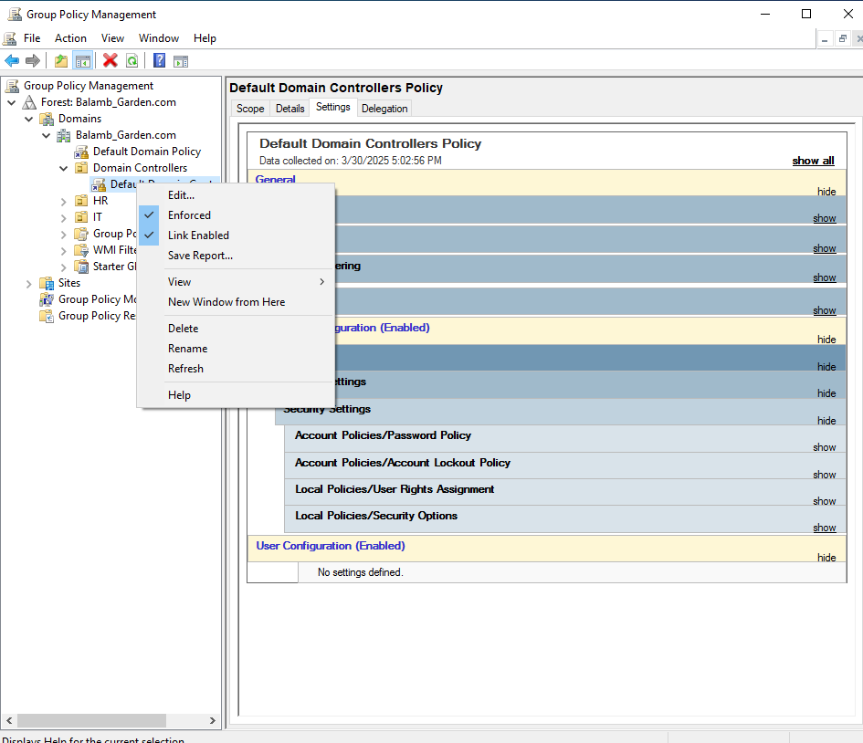{width="5.510416666666667in"
height="3.8333333333333335in"}

**Configuring Security Groups in Active Directory**

1.  Open **Active Directory Users and Computers (ADUC)**.

2.  Navigate to **Users**, then right-click and select **New Group**.

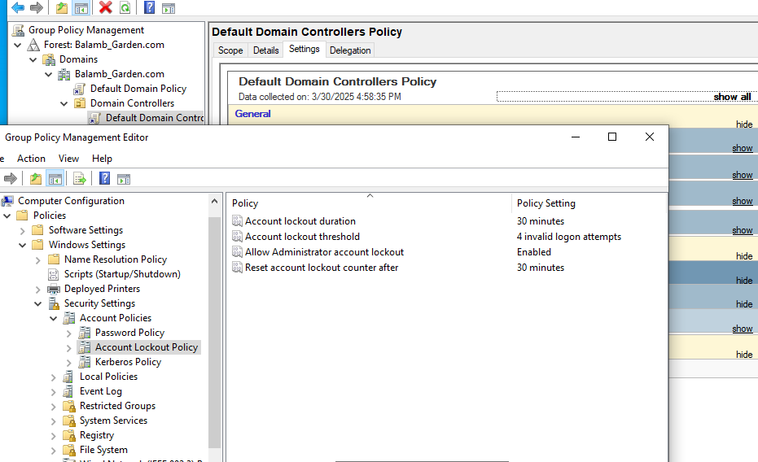{width="6.103699693788276in"
height="4.915972222222222in"}

3.  Create two **Security Groups**:

    - HR (for employees requiring HR file access).

    - Personal (for user-specific personal storage).

    - *Security Groups ensure that only authorized users can access
      designated resources.*

4.  Assign a **group manager** if necessary. Some companies may have a
    designated manager for specific resources.

> {width="4.958333333333333in"
> height="4.9375in"}

5.  Add members to each group:

    - Right-click the group -\> **Properties** -\> **Members** -\> **Add
      Users**.

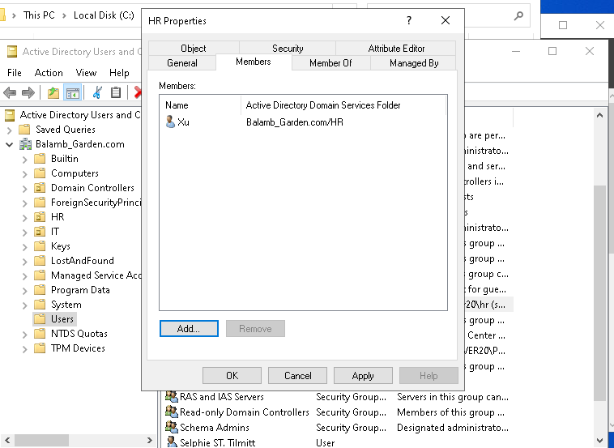{width="5.322916666666667in"
height="3.8854166666666665in"}

- Verify group assignments by checking User -\> Properties -\> Member
  of.

- You can also add a description in the General Tab of the folder for
  clarity.

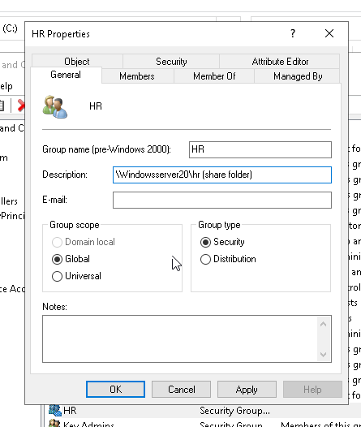{width="3.0208333333333335in"
height="3.5729166666666665in"}

**Applying Security and Sharing Permissions**

1.  Right-click the HR or Personal folder -\> **Properties** -\>
    **Security** -\> **Advanced**.

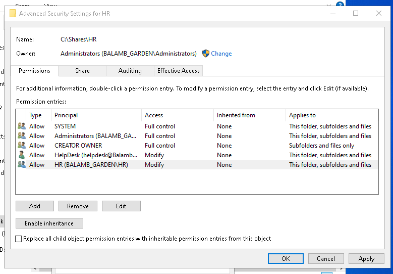{width="5.5625in"
height="3.8645833333333335in"}

2.  **Disable inheritance** to prevent unintended access.

3.  **Remove existing users** to ensure only *explicit* permissions are
    applied. There were previously two User principals present. It is
    generally important to keep SYSTEM, Administrators, and CREATOR
    OWNER as is.

4.  **Grant permissions to relevant groups**:

    - Click **Add** -\> **Select a Principal** -\> Assign HR and
      Helpdesk groups to the HR folder.

    - Assign Personal and Helpdesk groups to the Personal folder.

    - So, what does this accomplish? HR (Helpdesk & Xu) will have access
      to the shared HR folder. Theoretically, we could have everyone in
      the Personal security group. Coming up, we will make it so that
      each user has an individualized "Personal" folder.

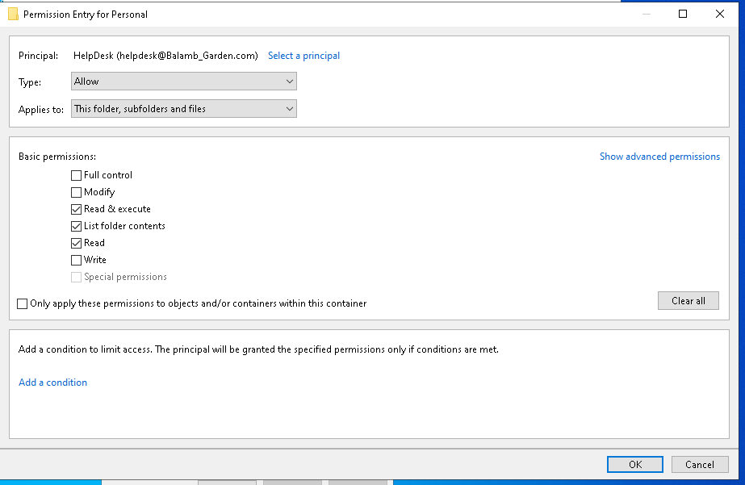{width="6.416666666666667in"
height="4.177083333333333in"}

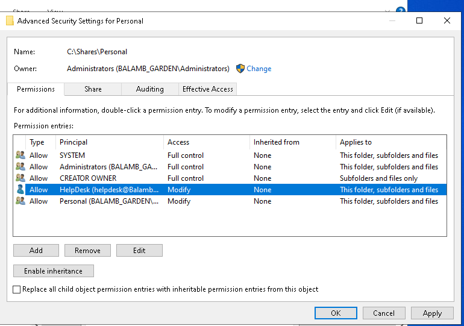{width="5.520833333333333in"
height="3.8746784776902885in"}

5.  **Configure sharing permissions**:

    - Navigate to Sharing -\> Share.

    - Assign **Read/Write** access to HR and Personal groups as
      appropriate.

------------------------------------------------------------------------

**Testing Shared Drive Access**

**Verifying Network Share Access**

1.  Log in as Xu on Desktop2.

2.  Open File Explorer and enter the **network share path**.

3.  Confirm that the user can access assigned folders and not
    unauthorized ones.

{width="6.5in" height="8.083333333333334in"}

**Mapping Network Drive for Easy Access**

1.  Right-click **This PC** -\> **Map Network Drive**.

2.  Enter the **UNC path** of the shared folder.

3.  Assign a drive letter and check **Reconnect at sign-in** if
    persistent access is required.

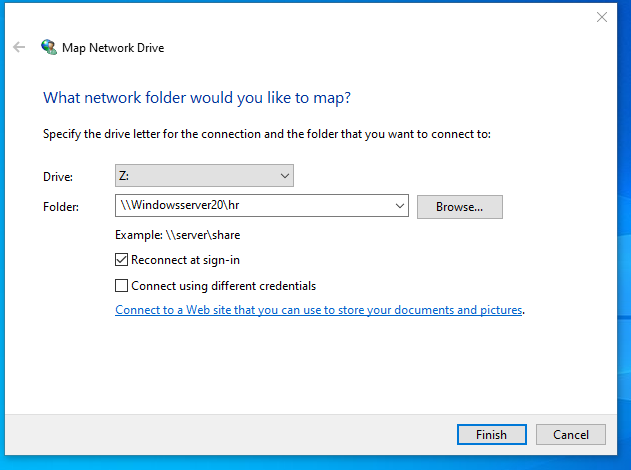{width="4.010416666666667in"
height="2.9791666666666665in"}{width="5.0625in" height="3.8125in"}

**Configuring Personal Folder Mapping for Each User**

- Each user in the Personal group should have a dedicated folder within
  the shared drive. (This is done on our HelpDesk machine).

- Configure this via **ADUC** in the **Profile** tab:

  - Xu -\> Properties -\> Profile

  - **Connect** P: to
    [\\\\WINDOWSSERVER20\\Personal\\%username%](file:///\\WINDOWSSERVER20\Personal\%25username%25)
    (It says Z: here, but I later changed the drive letter)

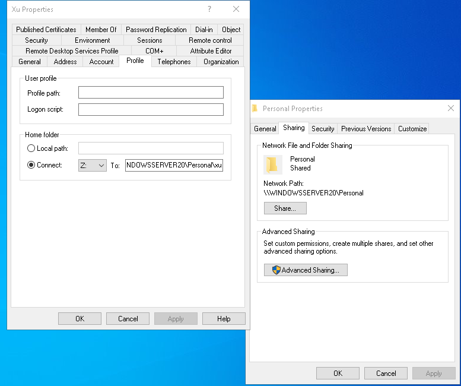{width="5.291666666666667in"
height="4.427083333333333in"}

- We can verify this by looking at Xu's file folders on Desktop2.

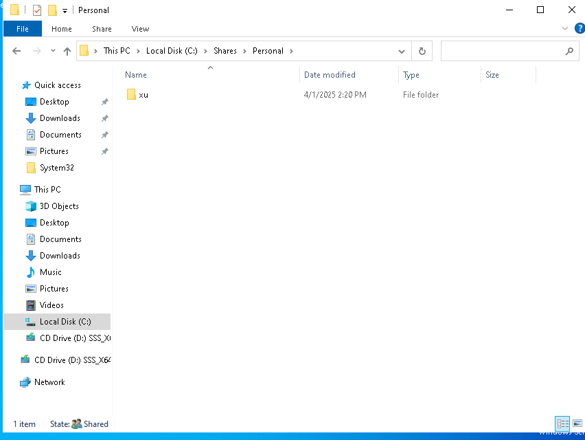{width="5.40625in" height="4.0625in"}

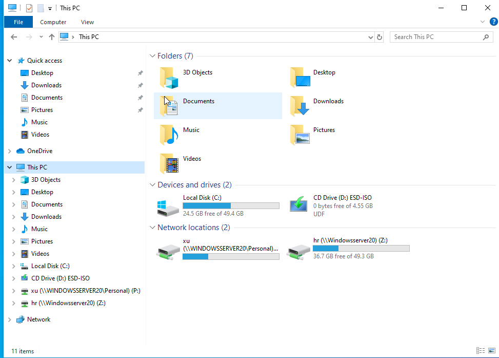{width="6.177083333333333in"
height="4.427083333333333in"}
