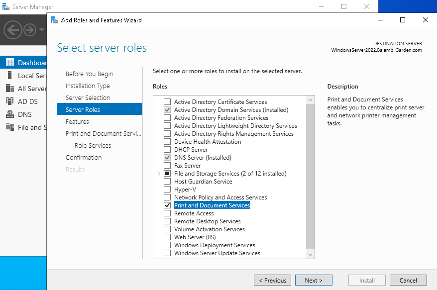
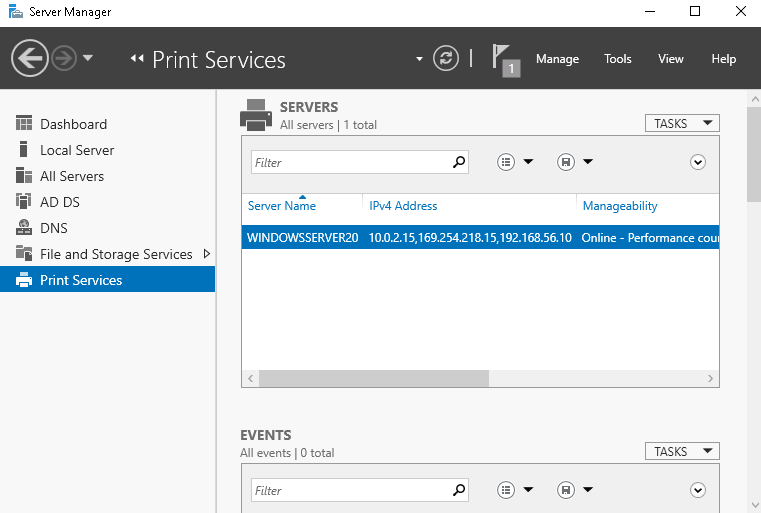
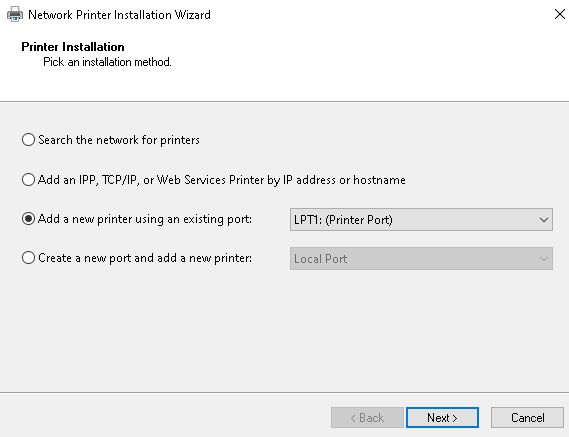
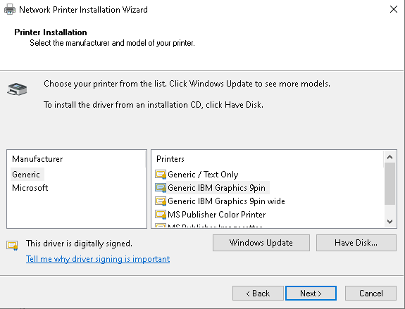
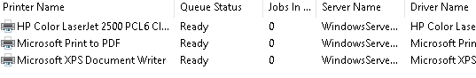
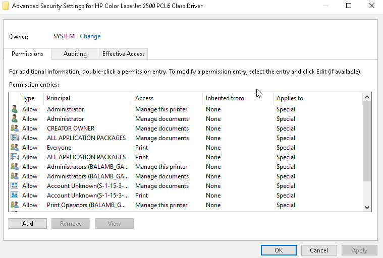
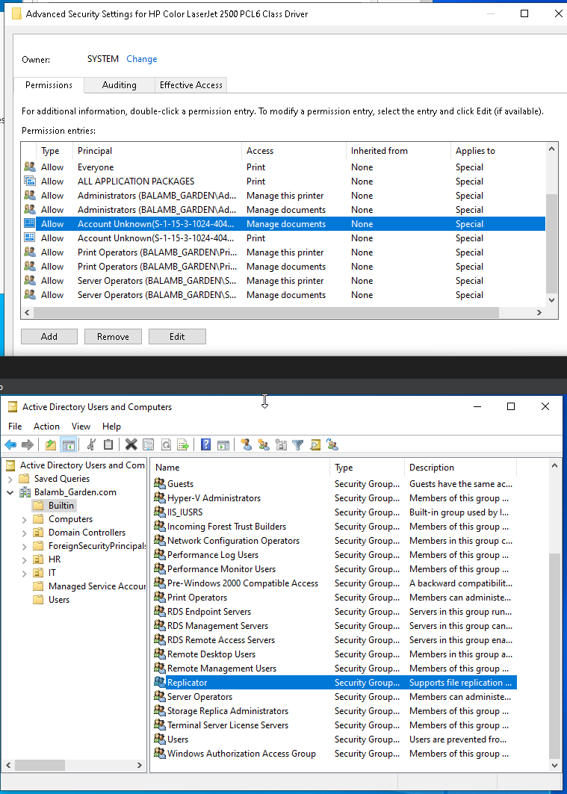
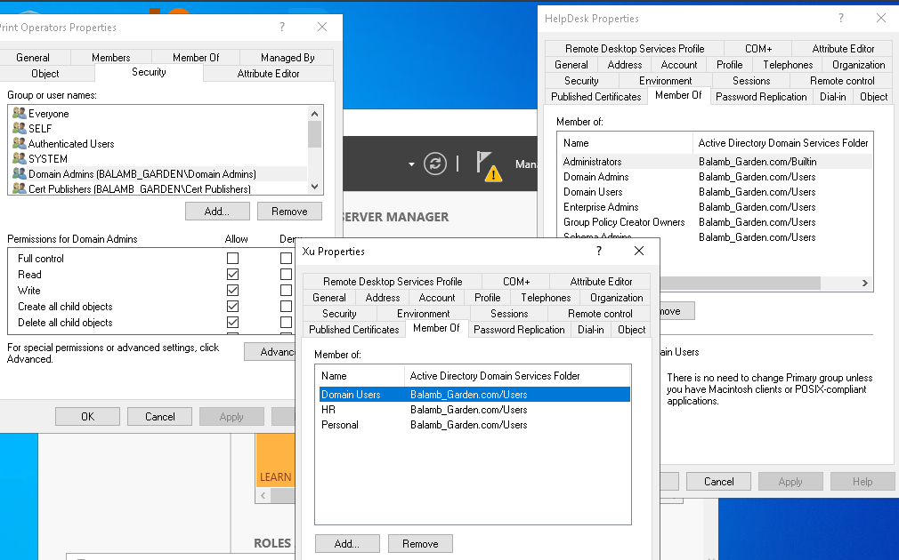
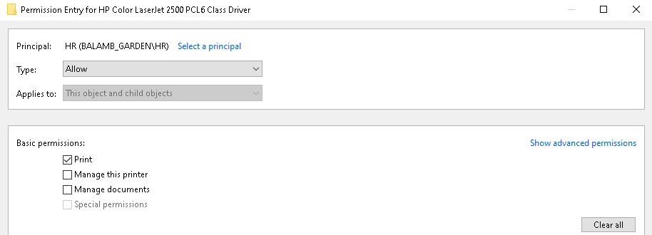
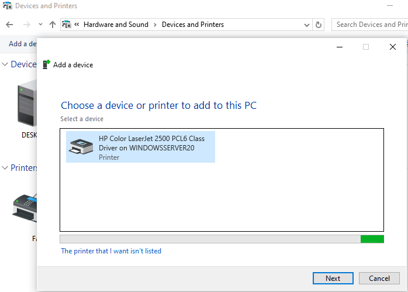

# Printer Management & Access Control in Active Directory

## Objective

Simulate real-world printer deployment and access control configuration using Windows Server Print Services in an Active Directory environment. This lab mirrors common tasks in help desk and junior sysadmin roles—especially where group-based resource access, permission auditing, and print infrastructure support are involved. It focuses on domain-integrated printer sharing, analyzing inherited permissions, and applying group-based restrictions to reinforce least-privilege principles.

## Tools & Environment

- Windows Server 2016 (Domain Controller)  
- Windows 10 Pro VMs (Clients for access testing)  
- Printer Management (via Server Manager)  
- Active Directory Users and Computers (ADUC)  
- VirtualBox with Host-Only Networking  
- User accounts: Administrator (Server), HelpDesk (admin-level), Xu (HR staff- Domain User)  
- Printer created and shared from the Domain Controller

## Lab Activities

### 1\. Installing Print Services:

- From Server Manager, I went through the familiar "Add Roles and Features" wizard and selected "Print and Document Services."

  

  \[Adding the Print and Document Services role via Server Manager to enable centralized network printer management.\]

- Once installed, I saw "Print Services" appear on the left-hand menu under Server Manager. This confirmed it was active, and I knew I’d be using Print Management under Tools for the rest of the lab.

  

\[Confirmation that Print Services is now available as a role — a foundational step before any print queue or driver configuration.\]

### 2\. Navigating Print Management & Adding the Printer:

- Inside Print Management, I right-clicked to add a printer. There were multiple methods here, but I went with an existing port and manually installed a driver.

  

\[Simulating a standard enterprise scenario using an existing LPT1 port for network printer setup.\]

- At first, the list of printer manufacturers/models was oddly limited—only a small handful showed up.

  

\[Initial driver list appeared incomplete — a somewhat unexpected quirk that I noticed.\]

- I backed up and evaluated. I actually needed to apply an update (which I was able to do without disrupting the lab) to finally get the full list.

- I skipped naming details like location and description, since this was a lab environment and not a live enterprise context—but I noted that in a real setting, this would matter for organizational clarity and print tracking.

  

### 3\. Review the Printer’s Security Settings:

- After the install, I opened up the printer’s properties and navigated to the Security tab, then Advanced. I immediately noticed a list of groups I hadn’t touched: SYSTEM, CREATOR OWNER, Server Operators, and Printer Operators.

  

\[Printer security shows multiple inherited roles — including Server Operators and Printer Operators — defined at the domain level.\]

- I went to ADUC and found that these groups live under the Builtin container.

  

\[Cross-referencing these roles in ADUC confirmed their location in the Builtin container — not something I had explicitly worked with before.\]

- I hadn’t worked with that container much before this lab, so it was interesting to see these “default” permissions surface so clearly in a real task like printer setup. It reminded me that AD structure goes deeper than just OUs and custom groups—it includes foundational access templates.

### 4\. Understanding Access- Admins vs. Standard Users:

- I used HelpDesk (a Domain Admin-level account) and Xu (a standard HR user in the Domain Users group) to test access. HelpDesk could manage and configure everything as expected. Xu, meanwhile, had no print access by default.

  

- To simulate a real-world permission assignment, I added the HR group to the printer’s security tab and granted Print access.

  

\[Assigned print-only access to the HR group — a test of applying least privilege while preserving function.\]

- I then validated that Xu was able to \[have the ability to\] print successfully once this change was made.

- This was a perfect example of how access to a resource can seem invisible until tested. The lab emphasized that group membership and inheritance determine access—something that’s easy to miss when troubleshooting basic user complaints.

### 5\. Observing the “Everyone” Group:

- I saw that the "Everyone" group had Print permissions by default. I paused here, because in a secure environment (especially one with different departments or sensitive documents), this would definitely be a misconfiguration. It made me think about printers in HR, Legal, or Finance—places where print jobs could contain confidential material. In those cases, access should be controlled tightly with either custom groups or per-user access.

- The "Everyone" group could easily cause silent chaos, especially if the company assumes the printer is locked down when it's actually wide open. This is also a relatively common way that malicious actors gain access to a business’s network and proceed to gain ever more pervasive access. Even the most seemingly innocuous parts of infrastructure need to be considered.

### 6\. Finding the Printer in Active Directory:

- I opened ADUC and used the Find tool to search for the printer. It showed up just fine, confirming it had registered in the directory. This is helpful in a large organization where you want users to be able to search for and connect to printers through the directory structure. That said, it reinforces the importance of naming conventions and security hygiene—because directory-listed doesn’t mean directory-secured.

  

\[Xu was able to detect the printer post-permission change, validating that AD publishing and access worked as intended.\]

## Key Takeaways

- Printer permissions are controlled by AD group inheritance, not just direct assignments.

- The Builtin container includes several preloaded security groups that show up automatically in resource properties

- The “Everyone” group is a dangerous default and should be evaluated in any real environment.

- Group assignments must be validated through user testing—not assumed based on policy.

## Final Thoughts

This lab surprised me in how much it actually covered and lead me to engage with. I expected a mostly streamlined, simple process—install, click through, and be done. Which CAN be the case, but that wouldn’t account for various components an IT department needs to consider in a real environment. Instead, it became a deep dive into how domain-level permissions and security groups govern even something as simple as printing.

What made it click: understanding that resource permissions in Windows domains don’t just exist in a vacuum. They reflect broader administrative structure.

This wasn’t just about setting up a printer. It was a lesson in access control, inheritance, and security visibility. Printers may seem like a non-critical system, but this lab showed me that even a shared device can be a potential point of failure if permissions are poorly managed. It's one more example of how small misconfigurations can become real-world vulnerabilities.
