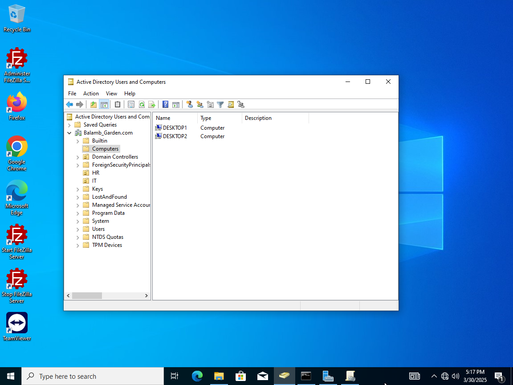
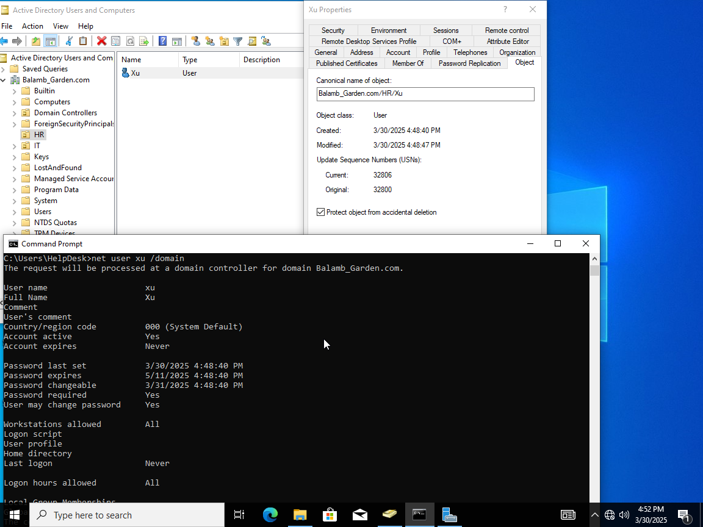
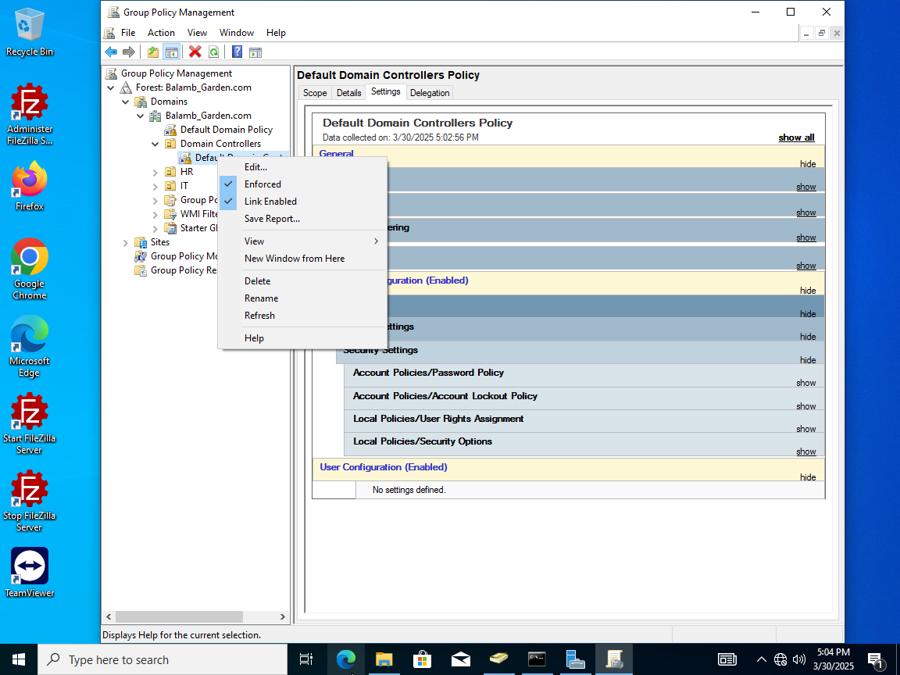
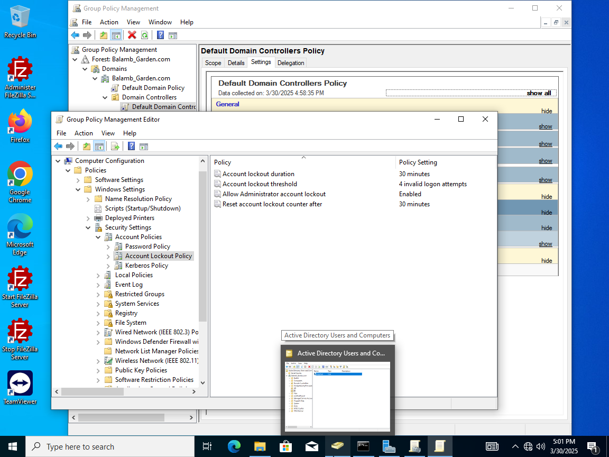
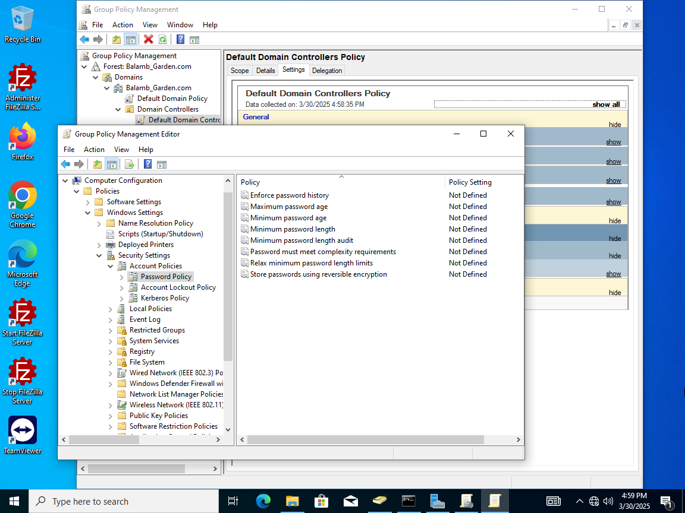

**Setting Up a Second VM as a User Workstation**

**Creating a Second Virtual Machine**

- Created a new virtual machine (VM2) named **Desktop2.**

- Configured **Desktop2** to function as a standard employee or general
  user workstation.

> 

------------------------------------------------------------------------

**Configuring Active Directory Organizational Units (OUs)**

1.  **Creating and Organizing OUs:**

    - Created a new **HR Organizational Unit (OU)**.

    - Created a new user, **Xu**, and moved it to the **HR OU**.

> 

- Created an **IT OU** and moved the **Helpdesk user** into the IT OU.

2.  **Using the Attribute Editor:**

    - **Properties → Attribute Editor** provides detailed information
      about any selected object within Active Directory (e.g., users,
      computers, and OUs).

------------------------------------------------------------------------

**Managing Group Policies**

1.  **Accessing Group Policy Management:**

    - Navigate to **Group Policy Management**.

    - Go to **Domains → \[Your Domain\] → Default Domain Policy**.

> 

2.  **Editing Domain Policies:**

    - Contains policies related to **password settings, user
      restrictions, and expiration policies**.

    - To modify domain-wide settings, edit **Domain Controllers →
      Default Domain Controllers Policy**.

    - Ensure that changes are properly enforced by selecting
      **Enforced** after applying edits.

> 
>
> 

------------------------------------------------------------------------

**Adding Desktop2 to the Network and Domain**

1.  **Assigning a Static IP to Desktop2:**

    - Configured **static IP settings** for **Desktop2** to ensure
      reliable network connectivity.

    - Verified network communication by **pinging the domain** (e.g.,
      balamb_garden.com) or directly testing with the **server IP
      address**.

2.  **Joining Desktop2 to the Domain:**

    - Added **Desktop2 to the domain** to integrate it into the network
      environment.
