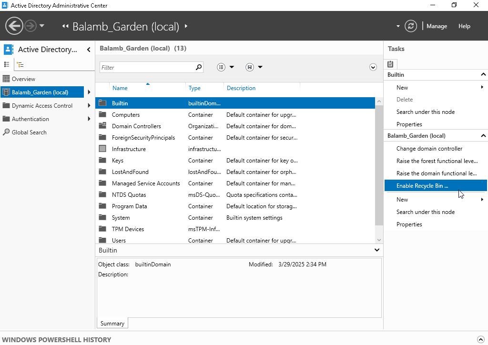
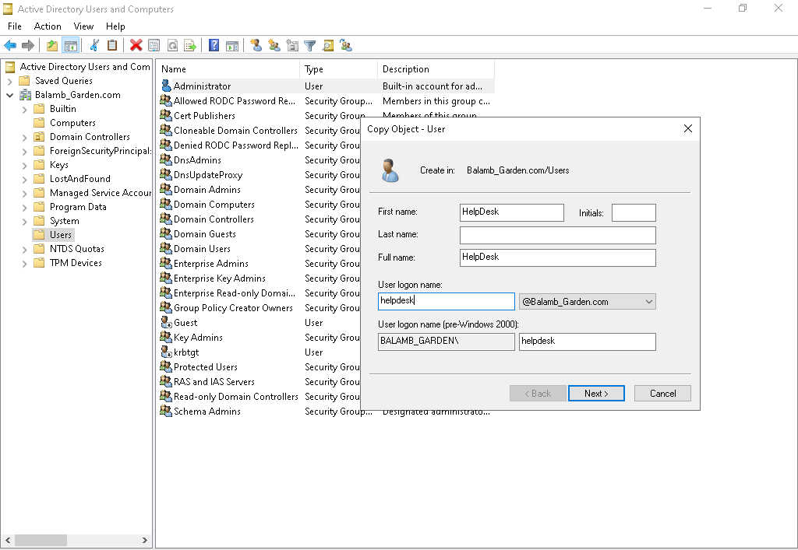
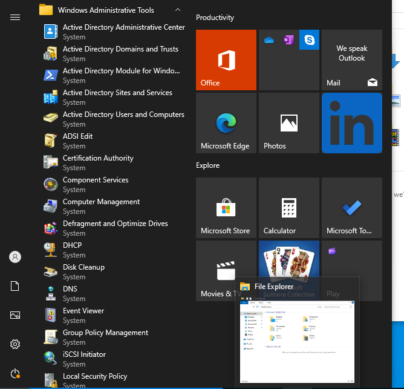
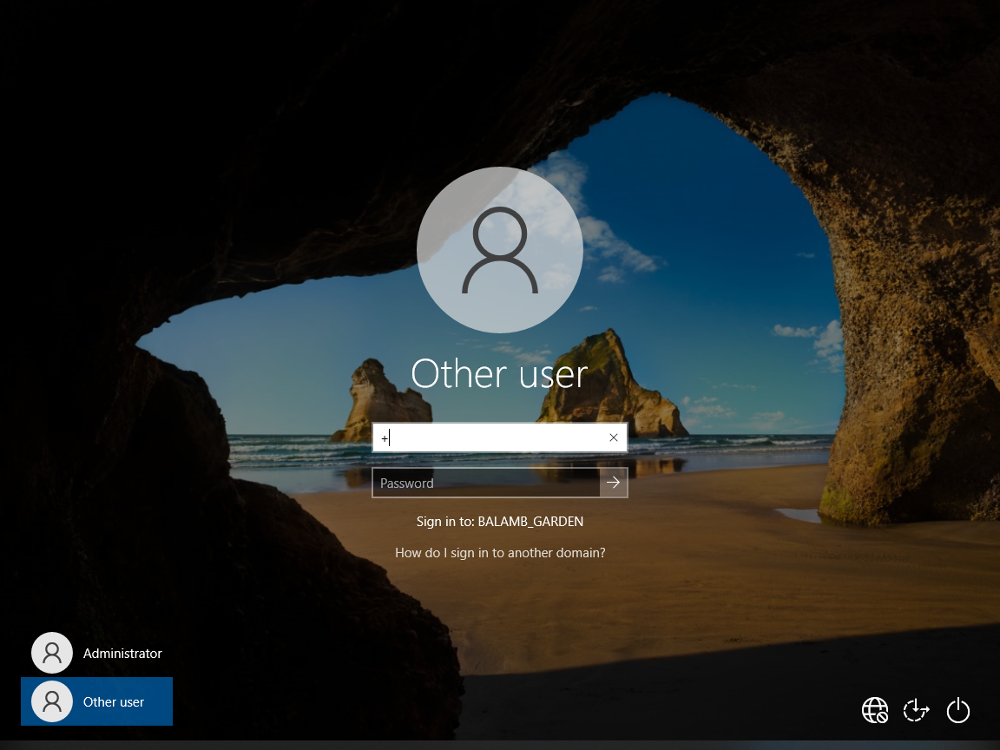

Using the Server Manager, we need to install Active Directory Domain
Services.

Navigate to Manage-\>Add roles/features-\>Role-based or feature-based
features-\>Active Directory Domain Services. There are a number of
services available here, but I only wanted to focus on the
aforementioned.

Configured a new forest named {Balamb_Garden.com}.

There were no forests initially present, and we needed one to interact
with many of the features available to us.

 

For convenience-sake, I created a pin to the Active Directory Users and
Computers window for easy access.

This window allows us to peer into some of the many things that I may
interact with on a daily basis. By going to View-\>Advanced Features, we
can see even more information about our domain.

 

For an IT Support role, we should be expected to have some type of
elevated privileges. They may not be exactly Administrator-level, but
for the purposes of my lab, I gave them to a designated helpdesk
account.

Copy the Administrator account and name the new account, HelpDesk.

This gives us our HelpDesk account with the necessary privileges to do a
number of important tasks.

It is much more efficient to copy a previous user\'s settings (that you
want to replicate) to a new account than to create a fresh account and
manually apply these same settings.

 

So now we have our Windows 2022 Server & {Balamb_Garden.com} domain
set-up, an admin-level HelpDesk account to work with, along with a look
at the administrative tools we may be using.

 

So, clearly, we won\'t be able to learn much about the actual duties of
support personnel by using only a Windows Server. We need actual devices
within that domain and network to interact with. My next task was
setting up a Windows 10 Pro account (which fortunately I had already
done the brunt of the work for).

I had named this machine \[Desktop1\] for simplicity\'s sake . It will
act as the main machine that I\'d be accessing my HelpDesk account from.
For that purpose, it will need all the necessary tools to be able to
provide support that a normal account wouldn\'t normally have.

Enable the Administrator account

Navigate to My Computer-\>Right-Click-\>Manage-\>Local Users and Groups

We might see that the Administrator account is initially disabled. All
we need to do is Enable it through it\'s Properties window to have
access upon Sign-In. You may need to set-up a password if it wasn\'t set
already.

Log-in to Administrator to install RSAT tools/services. These enable us
to use AD tools on a typical Windows 10 machine.

These are many of the tools and services that we already have access to
on the Windows Server. But we likely won\'t be working from it directly.

Navigate to \[Optional Features\] to find the various resources.

I installed \[Server Manager\] \[Remote Desktop Services Tools\] \[DNS
Server Tools\] \[Group Policy Management Tools\] \[DHCP Server Tools\]
\[Active Directory Domain Services & Lightweight Directory Services
Tools\] \[Active Directory Certificate Services Tools\]

Note: To even see/install these, you will need the appropriate
privileges on the account.

Once that is settled, we need to now connect Desktop1 to our domain.
This means making sure that the devices are in the appropriate network,
so that they may communicate with each other. 

\[Note: This isn't the final IP configuration for the network\]

Admittedly, this took some trial & error for me due to how VirtualBox
interacts with networks and the like. However, it was good practice and
probably similar to something that I\'d encounter out in the field. My
key takeaway was to ensure that our Domain Server and associated
machines have their Ips correctly configured. You might also need to add
a new rule to allow ICMP (ping) requests. I used a static IP to make
sure that things were working as intended. The \"**ping**\" and
\"**ipconfig**\" commands were essential in troubleshooting. If the
server and machine couldn\'t communicate both ways or only one-way, that
meant I needed to fix something. The Windows Firewall often came up as a
pain-point, but I decided against simply disabling it altogether to get
past these errors. I would rather not sacrifice security in favor of
simplicity. With enough time and effort, I got it working correctly.

**Server: 192.168.56.10**

**Desktop1: 192.168.56.11**

We can see here that the machine has been added to our domain.

Desktop1 can also be seen under Computers in the AD Users and Computers
window.

  It additionally appears on the Sign-In screen.

This allowed me to add Desktop1 to the {Balamb_Garden.com} domain and
have them both able to communicate. I also installed items such as
Teamviewer and Chrome for future experience.
