**Enabling Remote Desktop (RDP) on Desktop2**
---
**Objective:**

Prepare **Desktop2** for remote administration, simulating a scenario that would be common in a corporate IT environment.
---

**Steps:**

- **Login**: Log into **Desktop2** as **Helpdesk** or **Admin**.

- **System Settings**:

  - Navigate to **Control Panel → System and Security → System → Remote (Desktop) Settings**.

  - In the **Remote** tab, ensure **Remote Desktop** is enabled and **Allow remote connections to this computer** is checked.

> 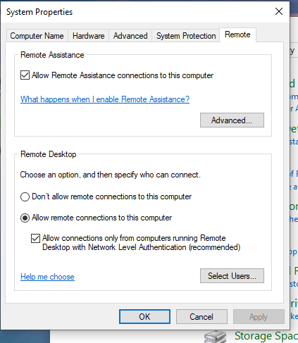

- Also enable **Remote Assistance** if necessary.

<!-- -->

- **RDP Sign-In (From Desktop1\[HelpDesk\])**:

  - When using **RDP**, both machines need to agree on the session. This often logs the target machine's user out, so be aware.

> 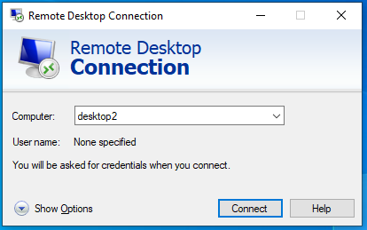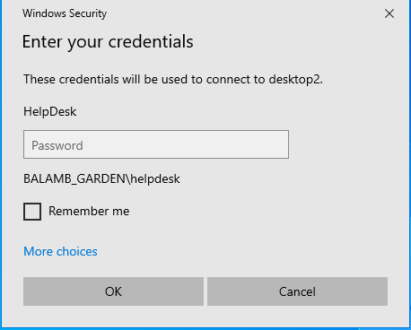
>
> 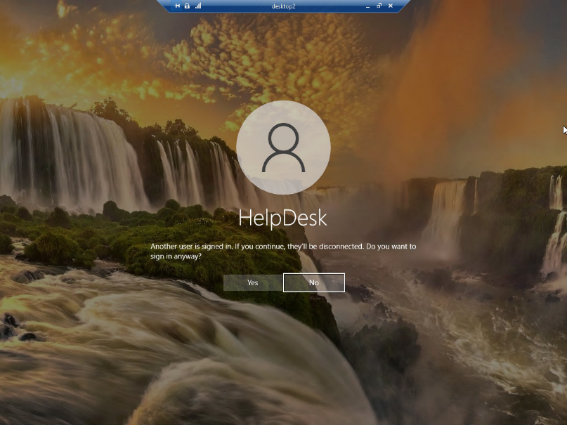
>
> 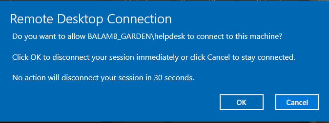

- If you run into issues connection to the target machine, run **cmd → ipconfig /flushdns** to clear any DNS issues.

**Notes:**

- **RDP** is typically already configured in many company environments for system administrators and support teams to remotely manage systems. Understanding how to set it up and troubleshoot issues like DNS or other connectivity conflicts is essential for ongoing support.

---

**Determining Shared Drives**
---
**Objective:**

Identify shared drives to access critical files and manage networked resources.
---

**Command:**

- Run **cmd → net use** to view current network shares mapped to the user.

> 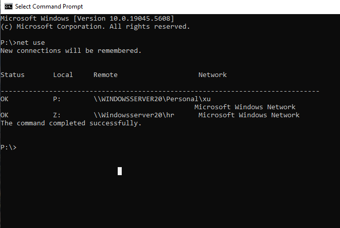

**Windows Administration:**

- Access **Windows Administration → Registry Editor** **→ Connect Network Registry**

  - Select target machine (**Desktop2**)

> 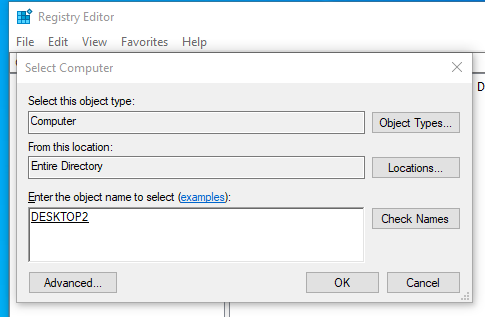

- Open **Registry Editor** and navigate to **HKEY_USERS → \[user SID\] → Network** to view network shares. Lots of information here, so I would only mess with this if you know what you are doing.

> 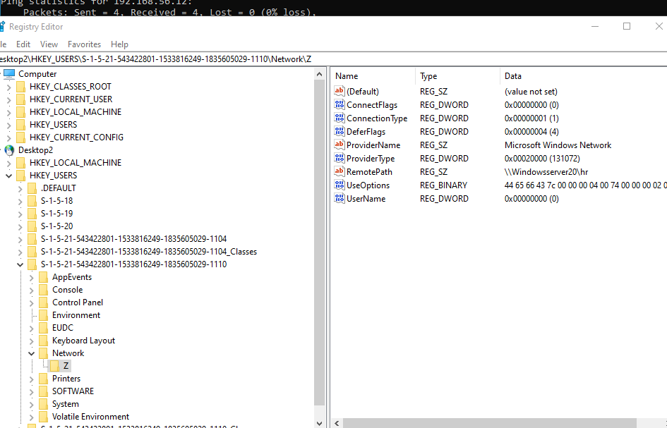

- Alternatively, access shared drives directly via **File Explorer**:

  - Type **\\desktop2\c\$** to access the C drive on **Desktop2** *from* **Desktop1.** You are able to move things around, add files, and make changes on a target machine *without* them needing to logout.

> 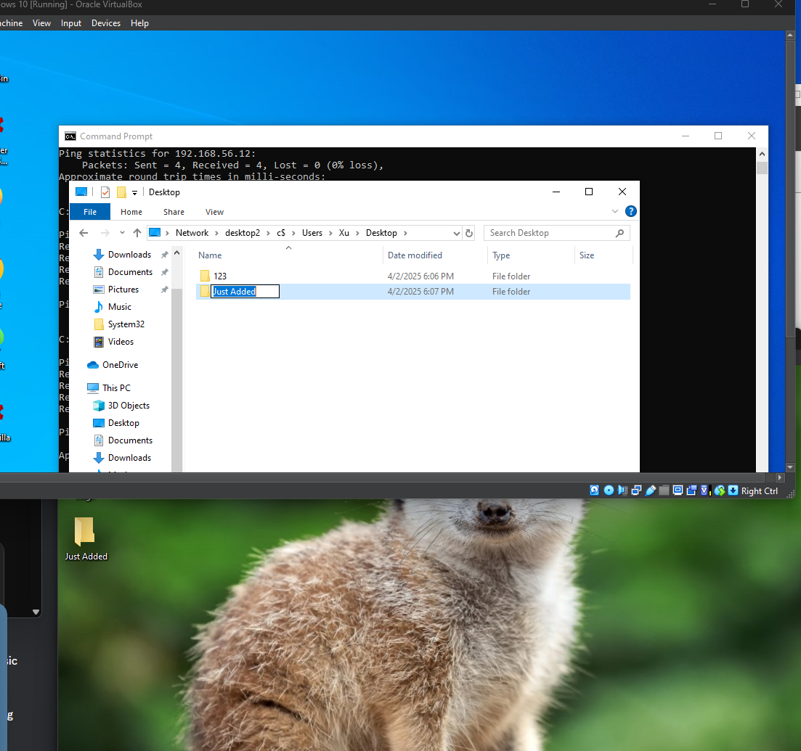

- **Troubleshooting Moment**: If you cannot remote into the machine:

  - I had initially received an error upon trying to connect to our **Desktop2**. I made sure that the **Remote Registry** service was enabled on both machines. I proceeded to test communications via the ping command. I discovered that **Desktop2** *could* ping **Desktop1**, but **Desktop1** *could not* ping **Desktop2**. This wasn’t an uncommon issue to have encountered.

> 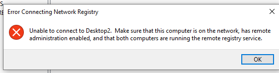

- I disabled the **Windows Firewall** on the Domain network. This often tends to be a contributing factor in many similar errors. Perhaps to no one’s surprise, ping then worked bidirectionally.

- To preserve our system and network security, I opted to ensure that **ICMP** requests were not being blocked by **Desktop2**. Disabling the Firewall would be the easiest method, but impractical in real-world scenarios. I enabled **ICMPv4-In** and **File and Printer Sharing (SMB-In)** rules.

> 

**Real-World Application:**

- **Accessing shared drives and network resources is vital in corporate environments** for IT staff to perform maintenance tasks or troubleshoot issues without interrupting user activity.
---

**Connecting to Remote Registry**
---
**Objective:**

Use **Registry Editor** to remotely manage the registry of **Desktop2**.
---

**Steps:**

1.  In **Registry Editor**, go to **File → Connect Network Registry**.

2.  Enter **Desktop2’s** name.

3.  **Troubleshooting Connection**:

    - If there is an error connecting, ensure **Remote Registry** is enabled on the target machine (Desktop2).

    - Test **ping** connectivity between **Desktop1** and **Desktop2**:

      - **Desktop2 could ping Desktop1**, but **Desktop1 couldn't ping Desktop2**.

      - **Fix**: Toggle the firewall on **Desktop2** on and off. This resolved the issue, but instead of leaving the firewall off, I enabled **ICMPv4-In** and **File and Printer Sharing (SMB-In)** rules in **Desktop2’s** firewall settings for more secure access.

**Real-World Application:**

- **Remote Registry** access is critical for support staff to edit system settings or troubleshoot registry-related issues on remote machines, especially in larger environments where physical access to machines may not be possible.
---

**Group Policy and Task Manager Restrictions**
---
**Objective:**

Use **Group Policy** to control access privileges on **Desktop2**, simulating a typical **security policy** for end-user workstations.
---

**Steps:**

1.  **Initial Setup**:

    - On **Windows Server 2022**, Open **Group Policy Management** → **Create New GPO**. I am going to disable **Task Manager** on those the policy is applied to.

> 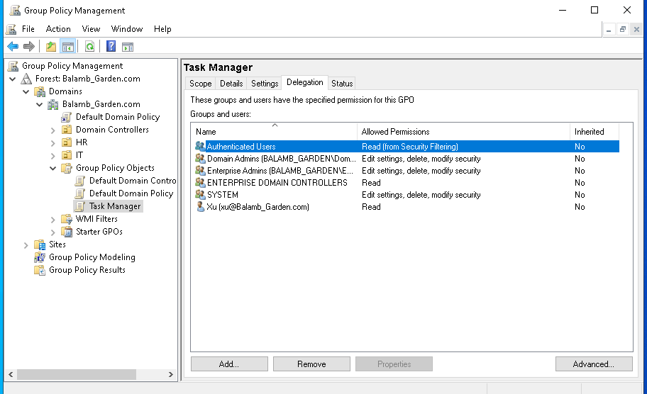

- Navigate to **User Configuration → Administrative Templates → System → Ctrl+Alt+Del Options**.

- Enable the setting **Remove Task Manager**. I enabled **Remove Change Password** to experiment also.

> 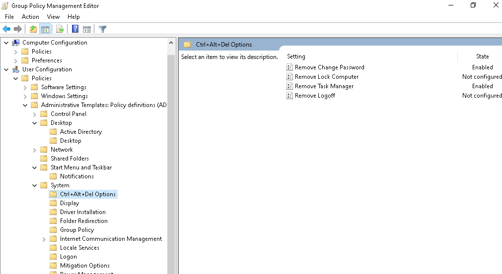

2.  **Apply the Policy**:

    - Drag the newly created GPO to the **HR** Organizational Unit (OU) to apply it.

> 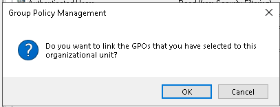

- Force the policy update using **gpupdate /force** on **Desktop2**.

- If the policy doesn’t apply immediately, a **relog** may be required. In my case, I had to log off **Desktop2** and log back in to see the changes take effect.

3.  **Verify Policy**:

    - Use **Group Policy Results Wizard** to verify if the policy is being applied correctly on **Desktop2**.

    - Run **gpresult /r** to check the applied settings on the user’s profile.

    - You can also try opening **Task Manager** via the command line, from the taskbar, or entering Alt+Ctrl+Del. Notice it is unavailable.

> 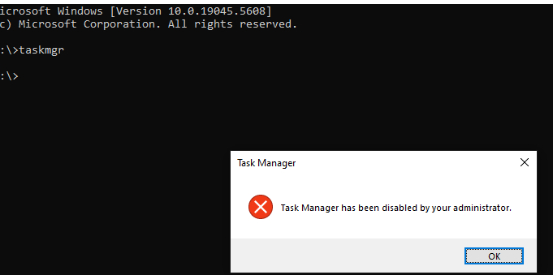
>
> 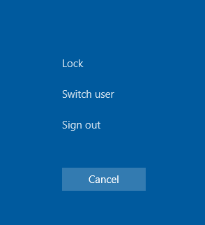

**Real-World Application:**

- **Restricting certain options is a common IT policy** depending on the context and environment. It can prevent unauthorized users from tampering with system processes. Applying such policies via **Group Policy** is crucial for system administrators to ensure end-user systems remain secure and well-managed.
---

**Using Group Policy for Shutdown and Restart Control**
---
**Objective:**

Modify **Group Policy** settings to prevent accidental shutdown or restart of machines remotely by removing the button.
---

**Steps:**

1.  In **Group Policy Management**, create a new GPO to restrict access to shutdown and restart commands.

2.  Navigate to **User Configuration → Policies → Administrative Templates → Start Menu and Taskbar**.

3.  Set the following:

    - **Remove and prevent access to the Shut Down, Restart, Sleep, and Hibernate commands** to **Enabled**.

4.  Apply the policy to **Desktop2** and force an update using **gpupdate /force**.

**Real-World Application:**

- **Preventing accidental restarts or shutdowns is important when using remote desktop tools**. System admins often restrict these actions on machines accessed via **RDP** to ensure systems are not unintentionally turned off during troubleshooting or remote support sessions.
---

**Monitoring and Troubleshooting Group Policy**
---
**Objective:**

Use **Group Policy Result Tools** to monitor and troubleshoot policies applied to specific machines or users.
---

**Steps:**

1.  **Group Policy Results Wizard**:

    - Run the **Group Policy Results Wizard** from **Group Policy Management** to generate reports on which policies are applied to a specific user or machine.

2.  **Analyze Reports**:

    - Use the **gpresult /r** command to view the result of applied policies.

    - Look for any discrepancies or errors in the applied settings, and use this information to make necessary corrections.
