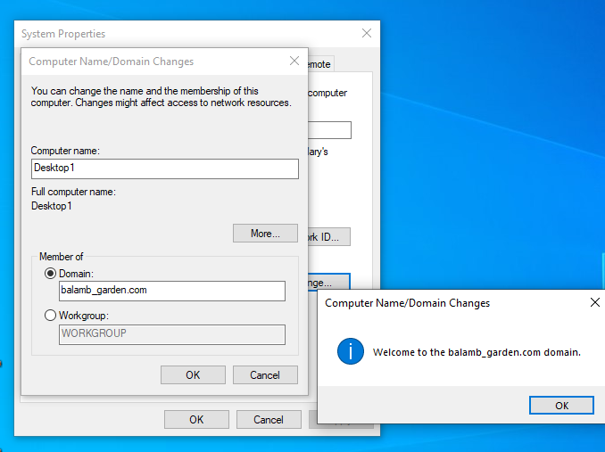
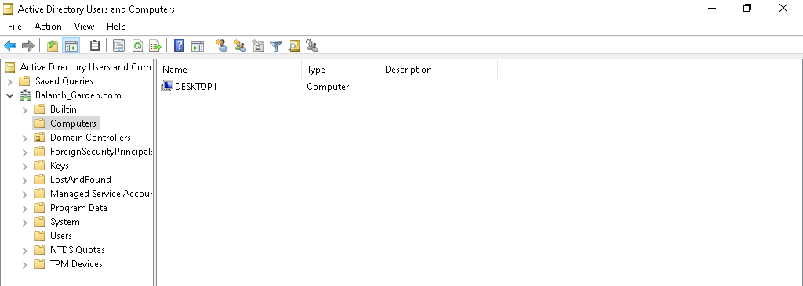
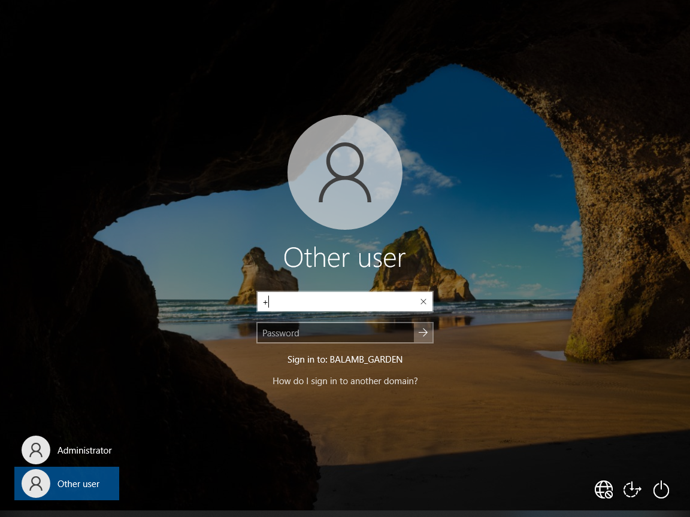

# PDQ Deploy & Inventory Lab: Silent Software Deployment & Asset Discovery

## Objective

Simulate real-world software deployment and system inventory tasks using
PDQ Deploy and PDQ Inventory across a small domain environment. This lab
mirrors responsibilities often expected in Tier 1.5 or Tier 2 help
desk/sysadmin roles---particularly in environments where silent
installations and asset tracking are required.

## Tools & Environment

- Windows Server 2022 VM (Domain Controller)\
- Windows 10 Pro VMs (Domain-joined workstations: Desktop1, Desktop2)\
- PDQ Deploy (Trial)\
- PDQ Inventory (Trial)\
- VirtualBox with Host-Only Networking\
- Shared folder via Guest Additions ISO (between physical desktop and
VMs)\
- Zoom MSI, PuTTY, and Notepad++ installers\
- Domain Name: Balamb_Garden

## Lab Activities

### 1\. Set Up Shared Access:

\[VirtualBox shared folder (Z:) successfully configured via Guest
Additions. This allowed me to move downloaded PDQ installer files from
my physical host machine to the Server VM.\]

- To begin, I configured a shared folder between my physical desktop and
  the VMs using the VirtualBox Guest Additions ISO. This allowed me to
  download the PDQ installers directly on my host machine, store them in
  a shared folder, and access them seamlessly from inside the VMs. This
  setup not only streamlined file transfer but mirrored a common
  real-world method of staging deployment files across isolated
  machines.

  

  \[Initial PDQ Deploy interface. Packages can be created from scratch
  or imported from the built-in PDQ Library to begin software
  deployments.\]

### 2\. Installed & Configured PDQ Deploy:

- After installation, I used the built-in PDQ Library to silently deploy
  the Zoom Client to both Desktop1 and Desktop2.

  

  \[PDQ Deploy's built-in Package Library. Includes ready-to-deploy
  software such as Zoom, Notepad++, and PuTTY---ideal for common IT
  tasks.\]

  

  \[Selecting targets from Active Directory in PDQ Deploy. Domain-joined
  systems such as DESKTOP1 and WINDOWSSERVER20 were available for
  package deployment.\]

- These types of deployments are critical in environments where end
  users are either unavailable or where remote desktop access isn't
  feasible.

  

  \[Zoom deployment setup using the Deploy Once feature in PDQ Deploy.
  Demonstrates targeting a domain-joined machine for a silent
  installation.\]

- It taught me how sysadmins can push software quickly and silently
  without disrupting users.

### 3\. Troubleshooting Deployment to the Server VM:

- When deployment to the Server VM failed using the PDQ Library package,
  I began isolating the issue.

  

  \[Initial deployment attempt to Server VM. Although the setup appeared
  valid, the Zoom installation failed---triggering troubleshooting
  around network adapters and permission paths.\]

- First, I verified basic connectivity using ping between Desktop1 and
  the Server---both systems responded successfully, ruling out a total
  network disconnect.

- I then reviewed the virtual adapter settings and noticed the Server VM
  had an additional network adapter enabled. After disabling this third
  adapter and confirming that the Host-Only adapter was active, I reran
  connectivity tests, which passed. I reattempted the Zoom deployment
  using the PDQ Library---this time to Desktop1 and Desktop2---and both
  succeeded. However, the Server VM continued to fail.

- At this point, I concluded the issue was not with PDQ, but with how
  the Server VM was resolving deployment paths or permissions
  internally. I pivoted to a manual method: I downloaded the Zoom MSI
  installer myself and built a custom deployment package in PDQ Deploy.
  This custom package installed successfully on the Server VM.

- This process taught me that built-in package libraries can sometimes
  conflict with unique environment variables---especially in virtual
  labs---and that building and testing custom installers is a valuable
  fallback skill in any admin/support role..

### 4\. Additional Deployments and Reasoning:

- I proceeded to test further deployments: PuTTY was deployed to
  Desktop1, and Notepad++ was pushed to all machines. PuTTY is useful
  for remote access and SSH sessions---a great tool to have on a Help
  Desk or sysadmin machine. Notepad++ is universally helpful for editing
  scripts, config files, or logs. The ability to deploy both tools
  silently helped reinforce the real-world applicability of PDQ.

### 5\. PDQ Inventory Setup and Exploration:

\[PDQ Inventory displaying general system information for Desktop2,
including domain affiliation, OS version, and current user.\]

- After installing PDQ Inventory on the Server VM, I added all
  domain-joined machines from the Balamb_Garden domain. At first, only
  the local Server machine appeared, but once I added the full domain
  via "Add Computers," the Inventory system populated with Desktop1 and
  Desktop2.

  

  \[Full Inventory view showing Desktop1, Desktop2, and WINDOWSSERVER20,
  including the NTLM target name mismatch error for the server
  machine.\]

- While reviewing the Server machine's profile in Inventory, I
  encountered an unexpected detail: it appeared under the name
  WINDOWSSERVER20, not the expected WindowsServer2022. This triggered an
  error: "NTLM: Target computer name mismatch."

- This moment clicked for me --- I remembered renaming the machine via
  Windows Settings, but Active Directory still reflected the original
  setup name. It helped me realize how naming conventions and character
  limits in AD and the OS can affect identity resolution across
  enterprise tools. In a real-world environment, this could lead to
  deployment failures or visibility gaps if not caught early.

- Beyond the error, I explored Inventory's key functions: application
  listings, hotfixes, shares, remote command options, reboots, and
  integrations with PDQ Deploy.

  

  \[Applications view for Desktop2 showing successful deployment of Zoom
  and Notepad++ via PDQ Deploy.\]

  

  \[Remotely running ipconfig on Desktop2 using PDQ Inventory's Run
  Command feature --- a helpful tool for non-intrusive diagnostics.\]

- I even remotely rebooted Desktop2 from within Inventory. Having this
  level of visibility and control emphasized just how crucial tools like
  PDQ are for endpoint management---and how easy it is to overlook a
  misconfiguration if you're not paying attention to details.

## Key Takeaways

\- Silent deployments reduce disruption and scale well across large
environments.\
- Network adapters must be understood and managed carefully in virtual
lab setups.\
- PDQ Deploy allows flexible package creation when default Library
installers fail.\
- PDQ Inventory provides deep insight into asset tracking and remote
control, similar to SCCM.\
- Working with PDQ helped solidify my understanding of real-world
support workflows, not just theory.

## Final Thoughts

This lab offered far more than a checklist of steps. It challenged me to
troubleshoot failures, think through alternate solutions, and consider
how these tools integrate into larger IT environments. I now have a
deeper understanding of how software like PDQ (Ivanti, SCCM, etc) fits
into the day-to-day workflow of a support technician or sysadmin, and
I'll continue expanding this lab to simulate a more robust deployment
infrastructure.
