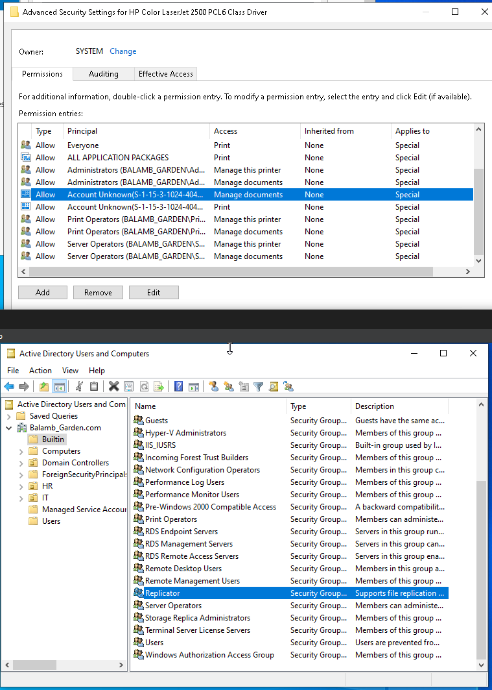
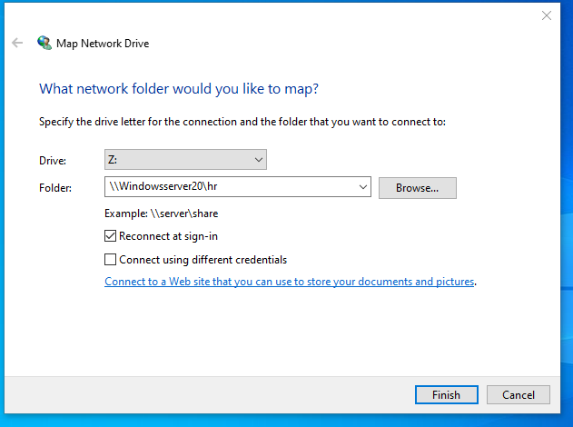

# Spiceworks, Delegated Control & Account Lockout Recovery

## Objective

Simulate a real-world help desk scenario from ticket creation to account remediation, incorporating remote support tools and Active Directory user management best practices. This lab explores delegated control, basic access restriction, and user lockout resolution — core concepts in daily support workflows. The Spiceworks portion also adds light exposure to modern cloud-based ticketing tools and remote desktop features often used in IT support environments.

## Tools & Environment

- Windows Server 2016 (Domain Controller)  
- Windows 10 Pro VMs (Clients)  
- Active Directory Users and Computers (ADUC)  
- VirtualBox with Host-Only Networking
-Account Lockout and Management Tools (ALTools)- Includes LockoutStatus.exe  
-Spiceworks Cloud Help Desk and Remote Support  
- User Accounts: HelpDesk (admin), Xu (simulated locked-out user), Nida (user for delegated access testing)

## Lab Activities

### 1\. Exploring Spiceworks Cloud Help Desk & Remote Support:

- This section explores Spiceworks Cloud Help Desk — a free, cloud-based platform for managing tickets and performing remote troubleshooting via Zoho Assist. It was used here to simulate the kind of end-to-end ticket workflow commonly handled in IT support roles.

- I first initiated a remote session using Zoho Assist, which powers Spiceworks’ remote support. A session ID was generated and entered on Desktop2 (Xu) to launch the connection

  .

  \[Generated session ID for Zoho Assist shown from HelpDesk perspective.\]

  

  \[Xu: Session invitation prompt with ID entry page: launching a remote support request.\]

  

  \[Active remote session showing HelpDesk (left) controlling Desktop2 (right).\]

- Once connected, I confirmed that Zoho Assist allowed full interactivity. Mouse control was shared, and Spiceworks provided a clean UI for ticket notes, technician chat, and screen actions. The sidebar toolset included:

- Sending system commands

- Capturing screenshots

- Launching device management tools

- Elevating to admin (with credentials)

  

  

  \[Sidebar options available during Zoho Assist session, including Elevate to Admin and file transfer tools.\]

- Once admin credentials were submitted, deeper tools like Computer Management became accessible within the remote session.

- While Spiceworks isn't enterprise-grade, its simplicity makes it an excellent training ground for remote workflows, user access, and live issue resolution — especially when combined with domain policy and user management on the backend.

### 2\. Delegated Control in Active Directory:

- Shifting back into the lab, I focused on simulating role separation through Delegated Control.

- In ADUC, I created a new user named Nida to represent a standard domain user with no admin-level access.

  

\[Created Nida’s user object with basic profile details filled in under the General tab.\]

- To isolate the scope of delegated permissions, I created a new Consultant OU where Nida was placed.

  

\[Consultant OU created under the domain root in ADUC for scoped permission testing.\]

- Using the Delegate Control Wizard, I granted a custom group scoped permissions over the Consultant OU.

  

\[Selected Nida as the delegated user during the setup wizard — bypassing group-based delegation.\]

- I selected only basic user functions — resetting passwords— enough to simulate what an intern or trainee might need to do without having full admin rights.

  

\[Scoped task: Reset passwords and force password change at next logon selected in delegation wizard.\]

- This process showed me how delegation in AD is more about assigning responsibility to trusted internal users than simply handing out roles. It’s granular, flexible, and ideal for large organizations.

### 3\. Simulating a Locked-Out User:

- To test how lockouts are detected and resolved, I manually triggered an account lockout scenario on Desktop2 using Xu’s credentials.

- Remember, that according to Group Policy (in previous labs), there is a 30 minute lockout timer after 5 invalid logon attempts. Even entering the correct password won’t allow Xu to logon.

  

\[Xu’s domain account was locked out after repeated failed login attempts on Desktop2.\]

- Now back on Nida’s account on Desktop1, we opened ADUC, and looked at Xu’s account properties. The “Unlock account” checkbox was unselected. I checked it and clicked Apply.

  

\[Nida used delegated access to unlock Xu’s account from ADUC by checking the “Unlock account” box.\]

\[First: Xu looking at Nida’s properties, Second: Admin looking at Xu’s properties\]

- It worked — she could log in again. But this wasn’t the full story. I wanted to trace where the lockout occurred and how the system knew it was time to trigger.

### 4\. Using Account Lockout Tools (ALTools):

- To dig deeper, I installed the Microsoft ALTools package and ran LockoutStatus.exe. This tool gave me insight beyond what the GUI shows.

  

\[LockoutStatus.exe displayed domain controller lockout metadata, including timestamps and bad password count.\]

- It let me see:

- The DC that processed the lockout

- How many bad password attempts were recorded

- Time of last failed login

- When the lockout flag was set

- This isn’t something you need to resolve every lockout. But in a large org with multiple DCs or GPO quirks, it's essential. LockoutStatus could help track down bad logon attempts or where a script or mapped drive might be spamming the system. It can help you determine whether these policies are too sensitive or even effective.

- This also introduced me to the concept of how persistent authentication loops — like cached credentials or stored service logons — can sometimes cause recurring lockouts if not investigated deeper.

## Key Takeaways

- Directly delegating control to users like Nida simulates practical role-based access in real orgs without overprovisioning

- Creating a dedicated OU (Consultants) allowed for isolated permission testing and clearer security boundaries

- Lockout recovery via ADUC is fast and intuitive — but tools like LockoutStatus provide root-cause visibility across DCs

- Persistent lockout issues can stem from cached credentials or scripts — surface-level fixes won’t always be enough

- Spiceworks provides an effective simulation of support/help desk workflows — ticketing, remote access, and admin elevation all come into play

- Remote sessions through Zoho Assist reinforce the importance of logging, permission elevation, and screen-based support.

## Final Thoughts

What stood out most about this lab was how naturally the technical pieces tied into real support workflows. Spiceworks, while lightweight, provided a legitimate simulation of frontline IT support — from creating a session ID to interacting with a live machine, elevating privileges, and troubleshooting remotely. It showed how accessible and impactful web-based tools can be when paired with proper policy and user management on the backend.

Working with delegated control helped highlight how permissions in Active Directory can be precise, controlled, and role-specific. Assigning narrow privileges like password resets to a single user within a scoped OU showed how environments can provide just enough access to get the job done — without compromising broader domain security. It gave me a better understanding of how organizations maintain separation of duties while still empowering support staff to resolve common issues quickly.

The lockout recovery piece built on that perfectly. Whether using ADUC or LockoutStatus, the ability to move from symptom to diagnosis — and understand which DC processed what and why — made the workflow feel complete. It wasn’t just about getting a user back in; it was about proving why they were locked out and confirming that the system worked as designed.

Beyond learning how the tools worked, this lab reinforced the importance of understanding why each tool is used — and how together, they simulate the daily operations listed in real job descriptions. From scoped permissions to live ticket resolution, these aren’t just concepts — they’re actions I’ve now performed end-to-end.
